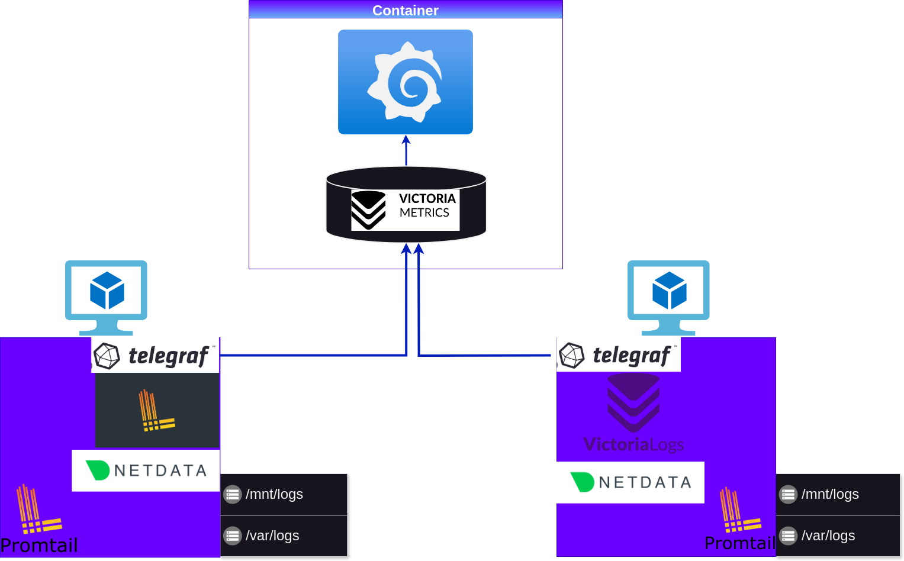
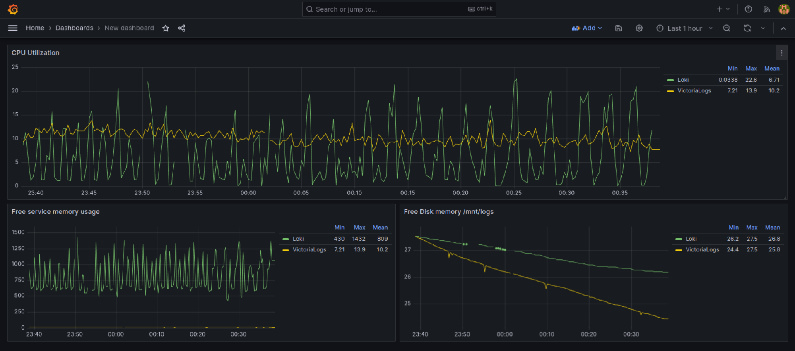

# VictoriaLogs and Loki benchmarks

## Setup 



Downloaded logs in an unarchived format are stored in the /var/logs directory, where they are scraped by Promtail.

```bash
root@vlogs-bench:/var/logs# du -shx *
4.9G    bench-logs
```

## Results




